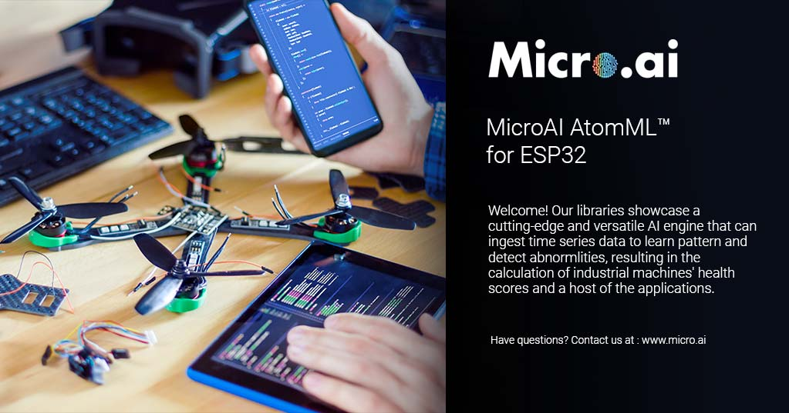

<!-- PROJECT SHIELDS -->
<!--
-->
[![LinkedIn][linkedin-shield]](https://www.linkedin.com/company/27247876)

<!-- PROJECT LOGO -->
 

  

  <h3 align="center">MicroAI Atom for the ESP32</h3>

  

    Access the Table of Contents below to browse through instructions, information about our MicroAI libraries, and more. We hope you enjoy our product launch and are excited to see what you and your teams can create!
     
    

<!-- TABLE OF CONTENTS -->
## Table of Contents

* [About the Project](#about-the-project)
  * [Built With](#built-with)
* [Getting Started](#getting-started)
  * [Prerequisites](#prerequisites)
* [Usage](#usage)
  * [APM](#apm)
  * [Security](#security)
* [Roadmap](#roadmap)
* [License](#license)
* [Contact](#contact)

<!-- ABOUT THE PROJECT -->
## About The Project

![Product Name Screen Shot][product-screenshot]

The ESP32 Project provides 2 sample implementations of the MicroAI Atom for this popular MCU platform.

* APM - Asset Performance Management

* Security - Security Monitoring

### Built With

* [ESP-IDF Development Tools](https://docs.espressif.com/projects/esp-idf/en/latest/esp32/get-started/index.html#)

* FreeRTOS

<!-- GETTING STARTED -->
## Getting Started

To get a local copy up and running follow these simple steps.

1. Clone this repository

2. Run "menuconfig" and provide WiFi connection parameters (required for the Security SDK, but optional for APM).

3. Build the project

4. Connect the development kit

5. Load the flash memory

6. Run the program

7. Monitor the output on the terminal screen

### Prerequisites

The IDF (IoT Development Framework) must be loaded onto the computer used for development. 

A step-by-step guide can be found on the [ESP-IDF website](https://docs.espressif.com/projects/esp-idf/en/latest/esp32/get-started/#installation-step-by-step).

<!-- USAGE EXAMPLES -->
## Usage

### APM
The APM SDK is capable of running as is (without live sensor inputs or output connections).  The results are viewed in the ESP-IDF command window. 

However, in order to enable sensor inputs as well as determine locations to send output messages, the user will modify the source code provided.  

An [APM SDK PDF file](APM/microAI%20ESP32%20APM%20SDK%20Version%201.0.pdf) details the project contents and the code required to be modified to make changes and send output to an MQTT server.

_Click on the image below to view a video tutorial for this project_

### Security
The Security SDK merely requires a valid WiFi connection.  The results are viewed in the ESP-IDF command window. 

A [Security SDK PDF file](Security/microAI%20ESP32%20Security%20SDK%20Version%201.0.pdf) details the project contents and the code required to be modified to make changes and send output to an MQTT server.

_Click on the image below to view a video tutorial for this project_

<!-- ROADMAP -->
## Roadmap

See the [open issues](https://github.com/ONE-Tech-Inc/MicroAI-Atom-ESP32/issues) for a list of proposed features (and known issues).

<!-- LICENSE -->
## License

See  [Software Evaluation Licensing Agreement](MicroAI%20Atom%20Evaluation%20License%20Agreement.pdf)  for more information.

<!-- CONTACT -->
## Contact

Company: ONETech

Website: www.micro.ai

Email: support@micro.ai

<!-- MARKDOWN LINKS & IMAGES -->
<!-- https://www.markdownguide.org/basic-syntax/#reference-style-links -->
[contributors-shield]: https://img.shields.io/github/contributors/github_username/repo.svg?style=flat-square
[contributors-url]: https://github.com/github_username/repo/graphs/contributors
[forks-shield]: https://img.shields.io/github/forks/github_username/repo.svg?style=flat-square
[forks-url]: https://github.com/github_username/repo/network/members
[stars-shield]: https://img.shields.io/github/stars/github_username/repo.svg?style=flat-square
[stars-url]: https://github.com/github_username/repo/stargazers
[issues-shield]: https://img.shields.io/github/issues/github_username/repo.svg?style=flat-square
[issues-url]: https://github.com/github_username/repo/issues
[license-shield]: https://img.shields.io/github/license/github_username/repo.svg?style=flat-square
[license-url]: https://github.com/github_username/repo/blob/master/LICENSE.txt
[linkedin-shield]: https://img.shields.io/badge/-LinkedIn-black.svg?style=flat-square&logo=linkedin&colorB=555
[linkedin-url]: https://linkedin.com/in/github_username
[product-screenshot]: Images/Overview.png

